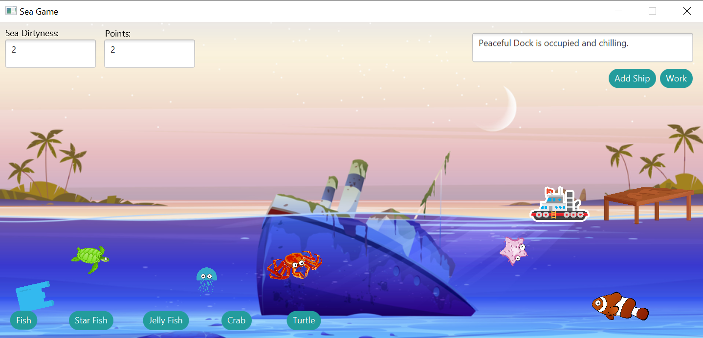
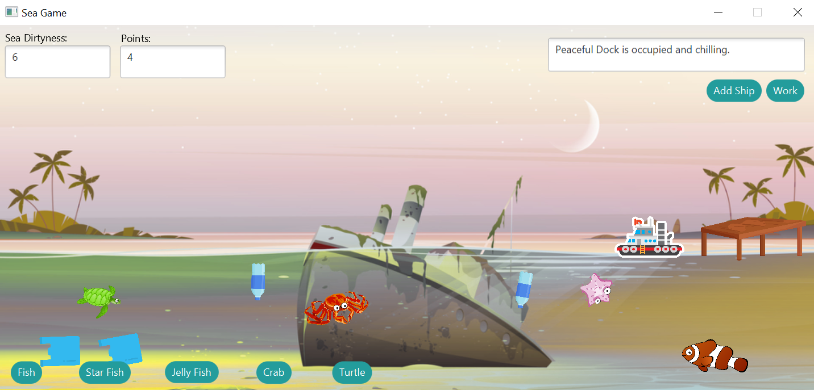

# Sea Game
A virtual sea simulation that utilizes various design patterns to enable the player to collect the rubbish, ship cargo and decorate the sea.  

## Background
This project was an assignment from WIF3007 Design Pattern subject. We were asked to propose and implement the suitable design patterns by creating a virtual space.

## Features
### Sea Simulation
The color of the sea will change based on the number of rubbishes in the system.
Apart from that, the pollution of the sea is simulated by auto-populating the two types of rubbish: plastic bags and plastic bottles underneath the sea.
Sea Game leverages the `Singleton design pattern` to enable the addition of several types of rubbish and the changing of colors of the water.

### Rubbish Collection
The rubbish is auto generated via `Simple Factory design pattern` once the user opens the application. The creation of rubbish objects will increase the dirtiness of the sea. The color of the sea will change according to the dirtiness level of the sea. To protect the sea, the player needs to collect the rubbish by clicking on it and earn points at the same time.

### Sea creatures Decoration
The sea allows the users to decorate it with diverse types of sea creatures. In this game, 5 sea creatures with different moving behaviors are provided:
- Fish (Horizontal movement)
- Jellyfish (Spin Rotate movement)
- Starfish (Vertical movement)
- Crab (Horizontal movement)
- Turtle (Horizontal movement)  

This feature is using the `Strategy design pattern` and `Command design pattern`, which the Sea Game implements the ability to add sea creatures with swim behaviors.

### Cargo Shipping Simulation
The `State design pattern` is employed in the dock feature, allowing players to add a ship to the dock. Then, the user can make the ship work such as loading cargo, setting sail from the dock, and letting the ship decide whether it should return to the dock. Users also can add a new ship while a ship is sailing off for cargo shipping.

### Point System (Gamification)
For the gamification element, Sea Game allows users to collect rubbish in the sea where rubbish collected will be added to the points.

## Setup Guide
[Setup Guide in Google Doc](https://docs.google.com/document/d/1HzJIuKeNeYc2omcXx_8L6RIWcz-IqAoTROKpi2vK0ys/edit?usp=sharing)